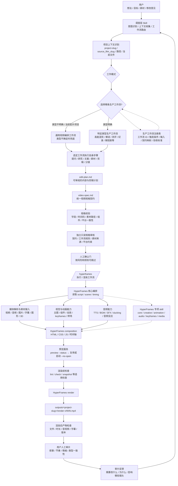
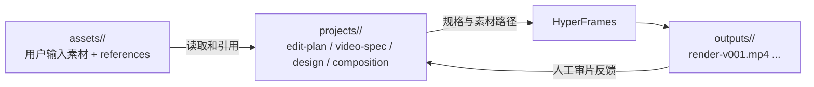
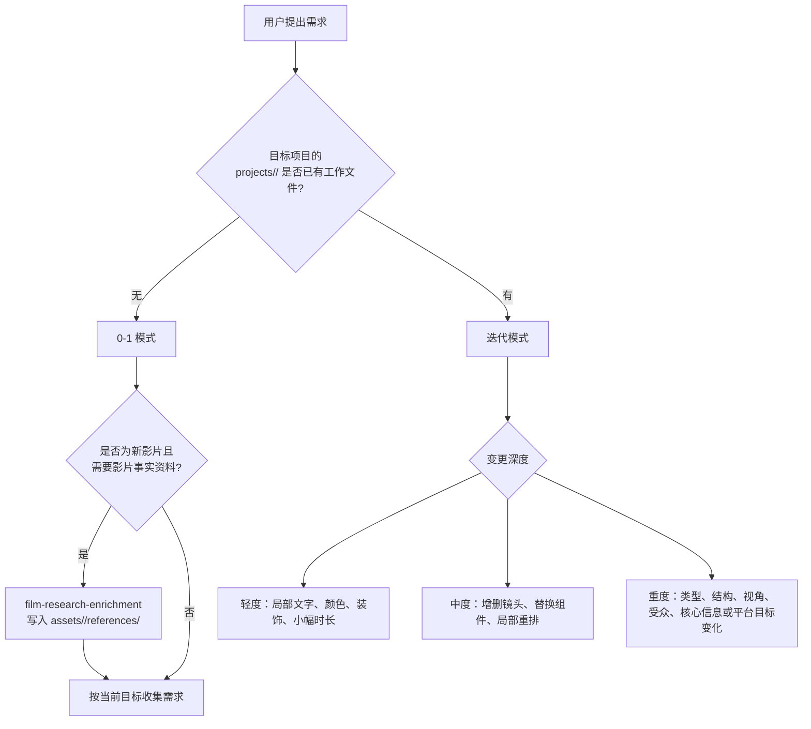
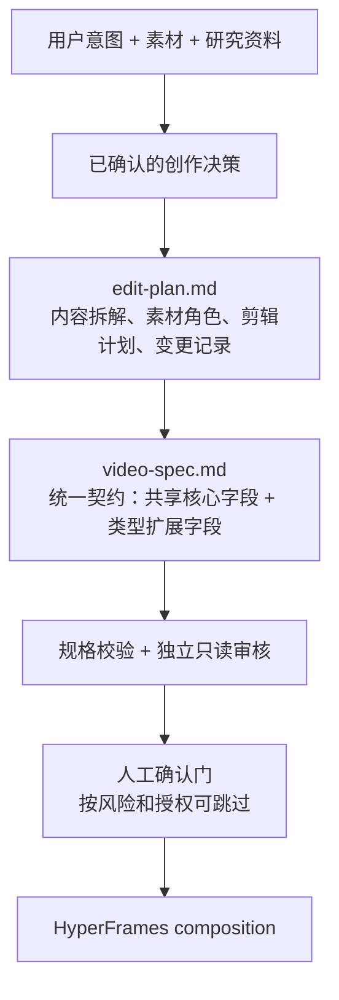
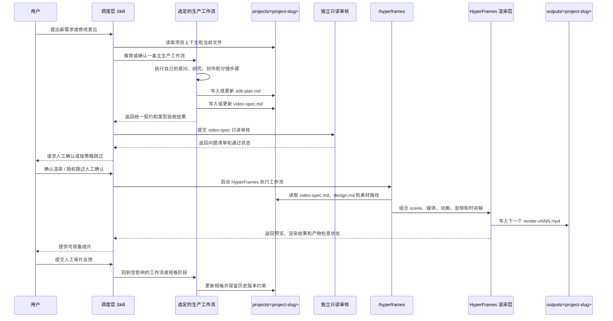
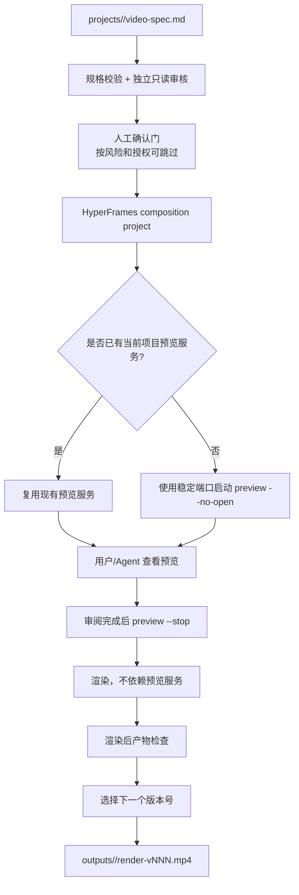

# 自主视频生产平台当前架构图

## 1. 文档目的

本文档描述当前项目从用户提出视频需求，到调度层选择生产工作流、生成 `video-spec.md`，再到调用 HyperFrames 生成可观看视频的完整链路。

本平台由四个主要部分组成：单一默认入口、通用视频编排工作流、特定类型生产工作流，以及渲染成片执行层。各生产工作流通过统一的 `video-spec.md` 契约，将结果交给执行层完成预览、渲染和产物检查。

文档同时标出两种状态：

- **当前链路**：目前可以按照现有 skill、reference、模板和 HyperFrames 工作流执行的部分。
- **扩展边界**：为了实现独立调度层、更多生产工作流、统一契约和质量门禁而预留的模块化位置。扩展边界不是当前已经自动实现的功能。

本文档是架构理解图，不替代具体执行规则。执行时仍以对应的 `SKILL.md`、`references/`、模板和仓库目录约束为准。

目录身份约定：`assets/<film-slug>/` 保存共享源影片输入；`projects/<project-slug>/` 和 `outputs/<project-slug>/` 分别保存一个独立视频交付项目的工程与渲染版本。不同视频类型、平台或时长使用不同的 `project-slug`。

当前实现与目标架构的关系：目标是独立的调度层 Skill；现阶段 `video-spec-builder-personal` 仍临时承载默认入口和通用视频编排工作流两部分职责。本文档中的“扩展边界”表示需要逐步抽取或新增的能力，不表示已经自动可用。

## 2. 一句话总览

```text
用户视频想法
    ↓
调度层 Skill：意图识别与工作流路由
    ↓
选择一条主生产工作流
    ↓
通用视频编排 / 特定类型生产工作流
    ↓
工作流执行自身的提问、研究、文案、素材、剪辑和分镜步骤
    ↓
统一 video-spec.md 契约
    ↓
自动规格校验 + 独立只读审核 + 可配置人工确认
    ↓
HyperFrames 等执行 / 渲染层读取规格
    ↓
渲染后产物检查
    ↓
outputs/<project-slug>/render-vNNN.mp4
    ↓
用户人工审片
    ↓
反馈回到调度层，再进入受影响的生产工作流或规格阶段
```

### 2.1 三层产品主链路

三层产品模型是一条连续链路，不是三个并列模块：用户层产生输入，方案层完成需求理解和生产编排，执行层完成成片交付，成片返回用户层；用户反馈再回到方案层迭代。后文的六层结构是这条主链路的运行时实现分解。

```text
用户层
用户提出需求，提供素材、参考资料和关键创意决策
  ↓
方案层
需求澄清
→ 匹配已注册的主生产工作流
→ 调用经过适配的共享或业务 Skill
→ 生成 edit-plan.md 与 video-spec.md
→ 规格校验、独立只读审核与人工确认
  ↓
执行层
根据已确认的 video-spec.md
完成剪辑、预览、渲染和渲染后产物检查
  ↓
用户层
观看成片并进行人工审片
  ↓
方案层
根据反馈修改规格或回到受影响的生产工作流
```

| 层级 | 在主链路中的职责 | 主要产物或结果 |
|---|---|---|
| 用户层 | 提出需求、提供素材、确认关键创意、审片和反馈 | 用户需求、素材、参考资料、确认意见、审片反馈 |
| 方案层 | 澄清需求、选择主生产工作流、调用已适配能力、形成规格并完成门禁 | 路由上下文、`edit-plan.md`、`video-spec.md`、审核结果 |
| 执行层 | 按确认后的规格完成 composition、媒体、动画、音频、预览、渲染和技术检查 | 预览、版本化成片、渲染后 QA 结果 |

### 2.2 三条核心产品链路

三条链路不是同层级的三段串联：视频生产主链路是交付主链，Skill 能力注册和视频拆解是进入方案层的两条支撑链。

#### 2.2.1 视频生产主链路

```text
用户需求
  ↓
需求澄清
  ↓
匹配已注册的主生产工作流
  ↓
生成 edit-plan.md 与 video-spec.md
  ↓
规格校验、独立只读审核与人工确认门
  ↓
执行剪辑、预览与渲染
  ↓
渲染后产物检查
  ↓
输出成片
  ↓
用户人工审片与反馈
  ↺ 回到方案层迭代
```

#### 2.2.2 Skill 能力注册支撑链路

```text
业务创意 / 开源项目
  ↓
Skill 封装
  ↓
能力说明、输入输出、适用场景、依赖与版本
  ↓
注册表登记与发现
  ↓
能力校验、依赖检查与版本兼容
  ↓
进入方案层，供主生产工作流调用
```

当前工作流注册表支持主生产工作流路由，但完整 Skill manifest、依赖解析、自动能力校验、版本兼容和弃用管理仍是规划中的扩展能力。

#### 2.2.3 视频拆解 Skill 支撑链路

```text
参考视频
  ↓
视频拆解 Skill
  ↓
结构、镜头、节奏、字幕、声音与视觉规则
  ↓
可复用规则包（含来源、版本与置信度）
  ↓
进入方案层，被视频类型工作流或业务 Skill 调用
  ↓
影响 edit-plan.md 与 video-spec.md
```

当前 `scene-breakdown` 仅覆盖“逐字稿 / 卖点 / 大纲 → 分镜表”；参考视频拆解为可复用规则包仍未实现，已登记为 `planned` 能力。

## 3. 端到端架构图



### 图中最重要的边界

1. 调度层 Skill 负责**理解意图、收集上下文、选择或确认生产工作流**，不负责替所有类型执行相同的创作流程。
2. 生产工作流负责**自己的提问、研究、文案、素材、剪辑和分镜步骤**，可以复用底层能力，但不能绕过统一契约。
3. `video-spec.md` 是生产工作流向审核层、执行层和迭代层交付的**统一接口**，由共享核心字段和类型扩展字段组成。
4. 独立只读审核和自动门禁负责发现规格与技术问题；人工确认可以按策略跳过，但必要的自动检查不可跳过。
5. HyperFrames 负责**把已确认规格执行成 composition 和视频**，不应在渲染阶段偷偷改变视频类型和叙事方向。
6. 渲染完成后，创意质量由用户人工审片；渲染产物的技术完整性由 Agent 和工具自动检查。

## 4. 调度层与当前生产工作流

### 4.1 调度层 Skill 的目标职责

```text
接收用户描述
    ↓
识别意图、内容来源、平台目标和约束
    ↓
读取项目上下文并判断新建或迭代
    ↓
匹配生产工作流注册表
    ↓
推荐或确认一条主生产工作流
    ↓
把任务交给选定工作流执行
```

路由规则：

- 用户明确类型时，优先匹配对应的类型生产工作流；
- 用户不确定类型时，推荐候选工作流，无法确认时回退到通用视频编排工作流；
- 输入、工具链、生命周期或产物差异明显时，仍由相应的特定类型生产工作流负责，必要时在工作流内部拆分阶段或使用变体；
- TTS、字幕、素材搜索、音频混音等属于可复用能力或子流程，不是额外的顶层生产工作流；
- 用户可以覆盖 Agent 推荐，但所选工作流仍必须遵守 `video-spec` 契约和质量门禁。

### 4.2 当前 `video-spec-builder-personal` 的职责

当前 `video-spec-builder-personal` 是通用视频编排工作流的当前实现，以影片素材为主要输入，仍包含以下内部步骤：

```text
确定源影片 + 交付项目 / 项目目录
    ↓
判断新交付项目还是已有项目迭代（同片不同类型也创建新项目）
    ↓
收集和确认视频基本盘
    ↓
盘点素材和研究资料
    ↓
确定视频类型或进入通用编排
    ↓
确定结构、视角、文案和剪辑策略
    ↓
拆分镜、写 edit-plan.md
    ↓
生成 video-spec.md
```

它当前可能被默认入口临时调用，但不是目标架构中的调度层。它不是：

- HyperFrames 渲染器；
- 单纯的脚本生成器；
- 所有视频类型的总调度器；
- 自动保证视频传播效果的系统；
- 替用户做核心观点和最终审片判断的系统。

## 5. 项目上下文与目录边界



这张图表示目录和文件的依赖关系，不代表可以跳过规格审核或人工确认门。实际运行仍必须遵守“规格校验 → 独立只读审核 → 人工确认（可按策略跳过）→ 执行 / 渲染”的顺序。

### 目录职责

| 目录 | 职责 | 允许放置的内容 |
|---|---|---|
| `assets/<film-slug>/` | 输入边界 | 用户提供的源视频、音频、字幕、图形、参考资料和研究 references |
| `projects/<project-slug>/` | 可编辑工作区 | `edit-plan.md`、`video-spec.md`、`design.md`、分镜和 HyperFrames 工程 |
| `outputs/<project-slug>/` | 可观看产物 | 递增版本的 `render-vNNN.mp4` |
| `videos/` | 旧版目录 | 只有用户明确指定时才使用 |

规则：不要把 spec、预览、渲染结果或生成音频写进 `assets/`；不要覆盖已有渲染版本。

## 6. 新片与迭代的分流

本图描述选定生产工作流内部的新建项目与迭代分流，不取代调度层对工作流的选择。不同生产工作流可以拥有不同的新建、研究和迭代步骤。



重度变更不能当作普通换镜头处理。例如：

```text
影视解说 → 高能混剪
纪录片 → 剧情短剧
第一人称 → 旁白上帝视角
线性结构 → 调查结构
```

这些变化会影响文案、素材排序、节奏、字幕、音频和分镜。

## 7. 生产工作流路由层

### 7.1 当前设计

调度层不直接执行所有类型的创作步骤，而是从生产工作流注册表中选择一条主生产工作流。视频类型是常见的工作流分类维度；当某种类型具有明显不同的输入、工具链、生命周期或产物质量模型时，应在相应的特定类型生产工作流中单独维护，必要时拆分为工作流变体。

```text
用户明确类型
    → 匹配对应的类型生产工作流
    → 由该工作流执行自己的提问、规划和创作步骤

用户不确定类型
    → 推荐候选工作流
    → 用户确认后进入选定工作流
    → 无法匹配或无法确认时回退到通用视频编排工作流
```

### 7.2 推荐生产工作流目录

未来可以采用类似结构，将调度层与生产工作流分开：

```text
.agents/skills/video-production-dispatcher/
└── SKILL.md

.agents/skills/video-production-workflows/
├── general-video/
├── high-energy-montage/
├── film-explainer/
├── documentary/
├── product-review/
├── tutorial/
└── live-cut/
```

每条生产工作流至少应定义：

```text
工作流 ID / 适用场景 / 不适用场景
必需输入 / 内部阶段 / 可复用能力
video-spec 核心字段映射 / 类型扩展字段
类型验收标准 / 失败处理 / 通用模式回退规则
```

目录只是推荐的扩展形态；真正落地时要遵守当前项目已有的 skill 组织方式。

### 7.3 一条生产工作流必须能够回答

```text
它是什么？
观众为什么停留？
开头怎么抓人？
中间怎么推进？
结尾给什么回报或下一步？
需要什么素材？
哪些剪辑手段是核心？
哪些做法会破坏类型？
如何验收成片仍属于该类型？
```

每条生产工作流的创作结果最终都要映射到：

```text
视频类型
→ 叙事结构
→ 表达视角
→ 文案策略
→ 剪辑语法
→ 平台目标
→ 分镜规格
```

## 8. 工作流内部创作层

### 8.1 统一创作映射

以下链路是所有工作流最终需要表达的创作决策维度，不是所有工作流必须执行的相同中间步骤。具体工作流可以根据素材形态和生产方式调整提问与创作顺序，但必须将结果映射到这些维度并写入 `video-spec`。


### 8.2 生产方式分流

并非所有视频都应该先写完整逐字稿：

| 生产方式 | 内容从哪里开始 | 典型类型 |
|---|---|---|
| `script-led` | 先确定旁白或脚本 | 影视解说、科普、教程 |
| `asset-led` | 先分析素材峰值和可用片段 | 高能混剪、赛事集锦 |
| `character-led` | 先找人物、冲突和转变 | 纪录片、真实故事、Vlog |
| `capture-led` | 先从直播或长访谈中发现段落 | 直播切片、访谈切片 |
| `interactive-led` | 先确定观众参与机制 | 挑战、互动剧情、AI 共创 |

每条生产工作流应根据视频类型和素材状态选择生产方式，而不是把逐字稿作为所有类型的统一前置。若生产方式导致输入、工具链、生命周期或产物质量模型显著变化，应在对应的特定类型生产工作流中作为工作流变体或内部阶段处理。

## 9. `edit-plan.md` 与 `video-spec.md` 的交接



### `edit-plan.md` 适合承载

- 内容和故事拆解；
- 素材盘点和缺口；
- 类型、结构和视角的推理；
- 章节、节拍和情绪曲线；
- 参考与反例的解释；
- 用户确认过的变更计划。

### `video-spec.md` 适合承载

- 渲染端需要的完整视频基本盘；
- 叙事结构和表达手段；
- 视觉规范；
- 素材清单；
- 每个 Scene 的时间、旁白、屏显、画面、动效、音效、转场和依赖；
- 音频时间轴；
- 开放问题和交付前自检结果。

`edit-plan.md` 是可审阅的中间计划，`video-spec.md` 是可执行的交付规格。二者不应互相替代。`video-spec.md` 生成后仍需经过规格校验、独立只读审核和人工确认门，不能直接绕过门禁交给渲染端。

`video-spec` 的共享核心字段包括项目目标、受众、平台与时长、叙事和分镜时间轴、素材引用、字幕与音频、视觉规则、渲染参数、来源与风险、待确认项、版本和验收信息。类型工作流可以在此基础上增加节拍点、论点证据、卖点步骤、分支状态等扩展字段，但不得另起一套无法被审核和执行层理解的输出格式。

## 10. 调度层、生产工作流与 HyperFrames 的交接



这里的交接关系很重要：

- 调度层不负责替所有视频类型执行相同的创作流程；
- `video-spec-builder-personal` 当前作为通用视频编排工作流的实现被调度；
- HyperFrames 不负责重新发明用户没有确认的内容方向；
- `video-spec.md` 是两者之间的正式接口；
- 用户可以在审核后选择是否启动 HyperFrames；必要的自动校验不可跳过。

## 11. HyperFrames 执行层

HyperFrames 执行层可以按需组合以下能力：

```text
video-spec.md
    ↓
HyperFrames core
    ├── composition contract / scene timing
    ├── media-use：素材、音乐、音效、图像、品牌资源
    ├── hyperframes-creative：视觉主题和设计约束
    ├── hyperframes-animation：基础动效和节奏运动
    ├── hyperframes-keyframes：缩放、推拉、重构和镜头运动
    ├── hyperframes-audio：音量、ducking、淡入淡出、音频自动化
    ├── captions-overlay / embedded-captions：字幕叠加（需要时）
    ├── oversized-cursor：需要指针叙事时
    ├── seam-craft / cut-the-curve：场景之间的转场接缝
    └── registry / components：可复用组件
    ↓
composition project
    ↓
preview / lint / check / snapshot
    ↓
render
```

不是每个视频都会调用所有能力。视频类型和素材状态决定哪些能力需要启用。

## 12. 预览、渲染和版本链路



预览服务器和渲染产物是两件事：

- 同一个项目只保留一个受管理的预览服务；
- 启动前先检查状态并复用可用服务；
- 审阅完成后停止预览服务；
- 渲染期间和渲染完成后不保留预览服务；
- 新渲染必须递增版本号，不覆盖已有 MP4。

## 13. 质量闭环


### Agent/工具适合检查的内容

- 字段是否完整；
- 时间码和总时长是否一致；
- 素材路径是否存在；
- 画幅、帧率和平台规格是否匹配；
- 组件 ID 是否真实；
- 音效时间点是否能对应 Scene；
- 字幕和布局是否违反明确的安全区规则。

### 必须由人观看判断的内容

- 开头是否真的抓人；
- 叙事是否清楚；
- 信息是否过载或不足；
- 节奏是否符合该视频类型；
- 情绪是否成立；
- 画面、声音和文案是否形成整体体验；
- 观众是否会产生预期行动。

自动检查不能替代人工审片。

## 14. 当前架构中的可扩展点

```text
扩展点 A：生产工作流注册表
    新增通用或特定类型生产工作流及其触发条件、输入和验收规则

扩展点 B：内容来源适配器
    电影 / 产品 / 品牌 / 创作者 / 直播 / 网站

扩展点 C：平台适配器
    抖音 / TikTok / Shorts / B站 / YouTube / 官网 / 发布会

扩展点 D：生产方式
    script-led / asset-led / character-led / capture-led / interactive-led

扩展点 E：HyperFrames 能力
    媒体、字幕、音频、3D、动画、转场、组件和渲染检查

扩展点 F：统一 video-spec 契约
    共享核心字段、类型扩展字段、版本和兼容校验

扩展点 G：审核与门禁
    规格校验、独立只读审核、人工确认策略和渲染后产物检查
```

新增生产工作流应该接入统一规格契约，而不是另起一套输出格式；共享能力可以被多个工作流复用，但不应把工作流内部步骤强行合并成一条流程。

当前仍未闭环的两项扩展能力是：参考视频到可复用创作规则的拆解，以及覆盖 Skill manifest、依赖、校验、版本兼容和弃用管理的完整能力注册链路。它们属于规划中的扩展边界，不代表当前已经可调用。

## 15. 当前架构的非目标

- 不让用户必须理解所有影视术语才能开始；
- 不为每一个视频类型复制调度层或规格契约；
- 不把所有类型规则塞进一个不可维护的巨大 `SKILL.md`；
- 不让某一种类型的节奏规则变成所有视频的全局硬约束；
- 不把外部参考视频误当作项目必需素材；
- 不让 HyperFrames 渲染层代替用户决定核心观点；
- 不把自动技术校验描述成创意质量保证；
- 不覆盖用户已有素材、历史 spec 或渲染版本。

## 16. 未来维护顺序

新增视频类型时，按以下顺序维护：

```text
1. 在本架构文档中确认类型定位和边界
2. 定义生产工作流的输入、内部阶段、创作规则和 video-spec 映射
3. 增加类型专属追问和方案引导
4. 增加节奏、字幕、音频和平台规则
5. 增加类型专属验收清单
6. 判断是否需要工作流变体或内部阶段拆分
7. 检查通用编排模式是否仍然可用
8. 检查 video-spec 契约、模板、审核和门禁是否需要同步
9. 用真实案例从需求跑到预览，确认人工审片反馈能回流
```

## 17. 最终架构结论

```text
一个默认调度入口
    + 多条可路由的视频生产工作流
    + 多个内容来源和平台适配器
    + 一套统一 video-spec 交付契约
    + 独立只读审核与确定性技术门禁
    + HyperFrames 执行与渲染层
    + 人工审片驱动的迭代闭环
```

当前最关键的接口是：

```text
用户
    → 调度层 Skill
    → 一条主生产工作流
    → projects/<project-slug>/video-spec.md
    → 规格审核与人工确认门
    → HyperFrames 执行 / 渲染
    → outputs/<project-slug>/render-vNNN.mp4
    → 渲染后产物检查
    → 人工审片反馈
    → 回到调度层并进入受影响的工作流或规格阶段
```

其中，`video-spec-builder-personal` 当前是被调度的通用视频编排工作流，以影片素材为主要输入，不是调度层，也不是特定类型生产工作流。未来新增视频类型、内容来源或平台能力时，优先通过工作流注册、共享能力复用和契约扩展接入，不改变平台级主链路。
